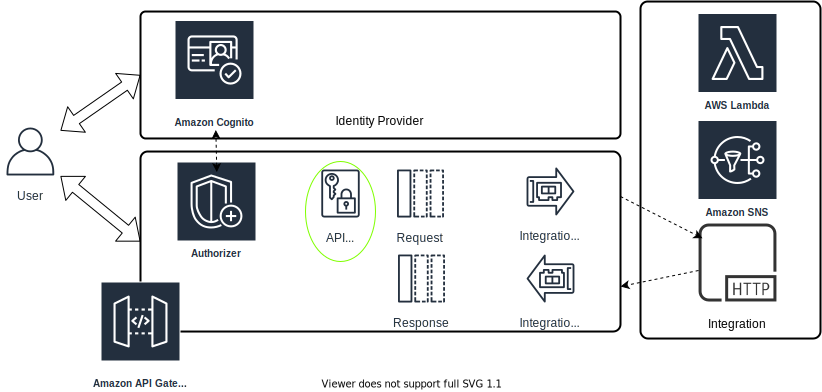

# Testing Setup

To test the OAS, there are 3 services to spin-up
 before using tools to send POST requests. 
1. JWT token authorization from AWS Cognito (which does not have a practical offline option for testing locally)
2. AWS API Gateway (v1 using REST API, v2 using HTTP API)
3. Netlify hosted echo endpoint acting as the HTTP integration (Lambda integration should be an IAM role and switching out the fully-qualified URL)

## Quickstart
- First deploy the echo service to Netlify.
- Deploy the API to AWS API Gateway and specify the Netlify URL as the HTTP integration
- Initiate user sign-in to obtain a JWT token
- Use the token to make the test POST request to the API

## Credits

AWS API Gateway details
 by [Alex DeBrie](https://www.alexdebrie.com/posts/api-gateway-elements/)

v2 AWS SDK for 
 [Golang](https://pkg.go.dev/github.com/aws/aws-sdk-go-v2)([LICENSE](https://pkg.go.dev/github.com/aws/aws-sdk-go-v2?tab=licenses))

Cognito JWTs and Amazon HTTP API
 by [Sander Knape](https://sanderknape.com/2020/08/amazon-cognito-jwts-authenticate-amazon-http-api/)

Dissecting HTTP APIs
 by [Tamás Sallai](https://advancedweb.hu/how-to-use-the-aws-apigatewayv2-api-to-add-an-http-api-to-a-lambda-function/)

chalice-cognito-auth
 [Python package](https://pypi.org/project/chalice-cognito-auth)

